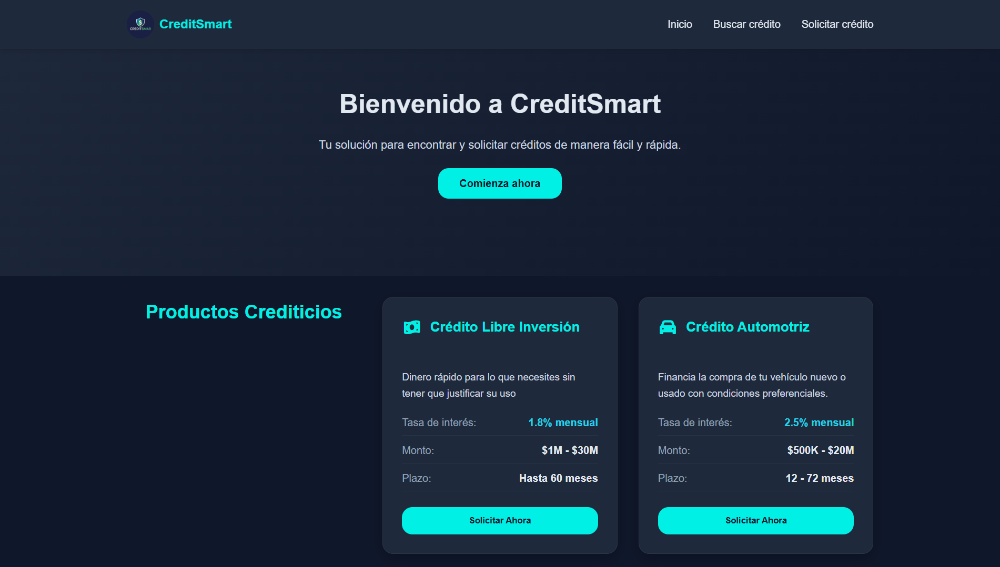
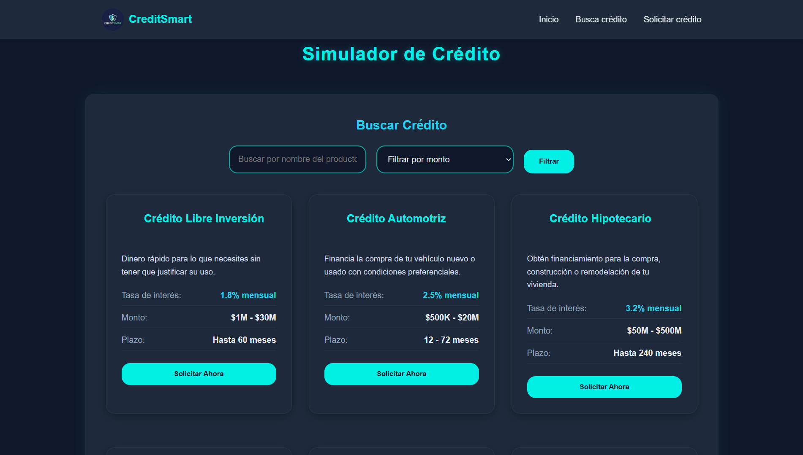
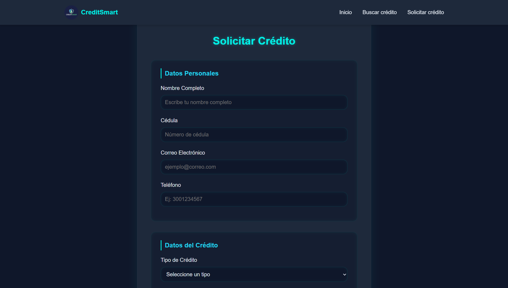

# 💳 Sistema Web de Gestión de Solicitudes de Crédito

> **Autores:**  
> 👩‍💻 *Sofía González Herrera*  
> 👨‍💻 *Henry Alejandro Giraldo Carmona*  

---

## 🎯 Objetivo de la Actividad

> ⚡ **Aplicar los conceptos fundamentales de HTML5, CSS3 y diseño responsive** para desarrollar las interfaces de usuario de un sistema web de gestión de solicitudes de crédito, implementando **buenas prácticas de maquetación**, **estructura semántica** y **diseño profesional**.

---

## 📘 Descripción del Proyecto

Este proyecto consiste en la creación de un **sitio web de tres páginas** que conforman un sistema para la **gestión de solicitudes de crédito**.  
Cada página cumple una función específica dentro del flujo de navegación del usuario:

1. 🏠 **Página Principal (`index.html`)**  
   Muestra el catálogo de créditos disponibles y permite navegar hacia el simulador o la solicitud.

2. 💰 **Página Simulador (`simulador.html`)**  
   Permite buscar créditos y calcular cuotas o montos según las condiciones ingresadas.

3. 📝 **Página Solicitar Crédito (`solicitar.html`)**  
   Contiene un formulario para que el usuario ingrese sus datos y realice la solicitud de crédito.

---

## 🧱 Estructura del Proyecto

├── index.html # Página principal (Catálogo de Créditos)
├── simulador.html # Página del Simulador de Créditos
├── solicitar.html # Página del Formulario de Solicitud
├── styles.css # Estilos generales del sitio (CSS3)
└── README.md # Documentación del proyecto


---

## 🖥️ Tecnologías Utilizadas

> 💡 **Frontend:**
- HTML5 (estructura semántica)
- CSS3 (estilos personalizados)
- Responsive Design (mobile-first)

> 🎨 **Opcional:**
- Bootstrap o Tailwind CSS (para mejorar el diseño y la adaptabilidad)

---

## 📱 Diseño Responsive

> ⚠️ **Requisito obligatorio:**  
El sitio debe visualizarse correctamente en **desktop**, **tablet** y **móvil**.  

✅ Se implementaron **media queries** y **layouts adaptables** para garantizar una experiencia de usuario óptima en todos los dispositivos.

---

## 🚀 Instrucciones de Ejecución

> 📋 **Pasos para visualizar el proyecto:**

1. Clonar o descargar el repositorio desde GitHub:
   ```bash
   git clone https://github.com/alek1819/creditsmart

### 🏠 Página Principal


### 💰 Simulador de Créditos


### 📝 Formulario de Solicitud



